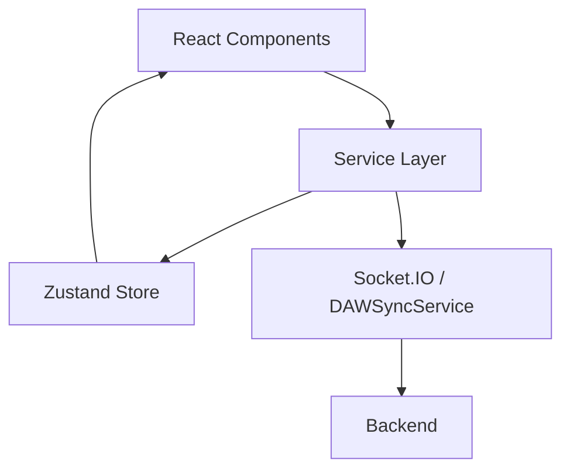
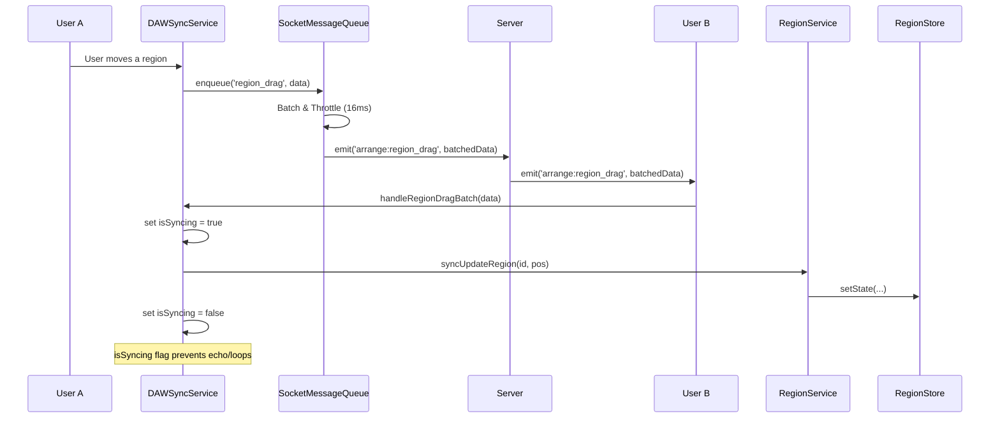
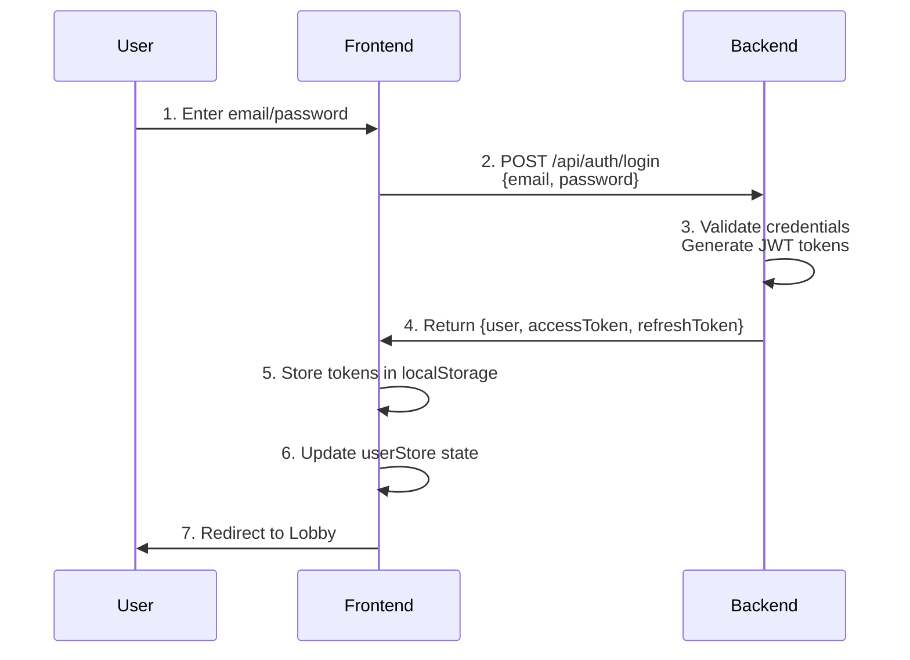
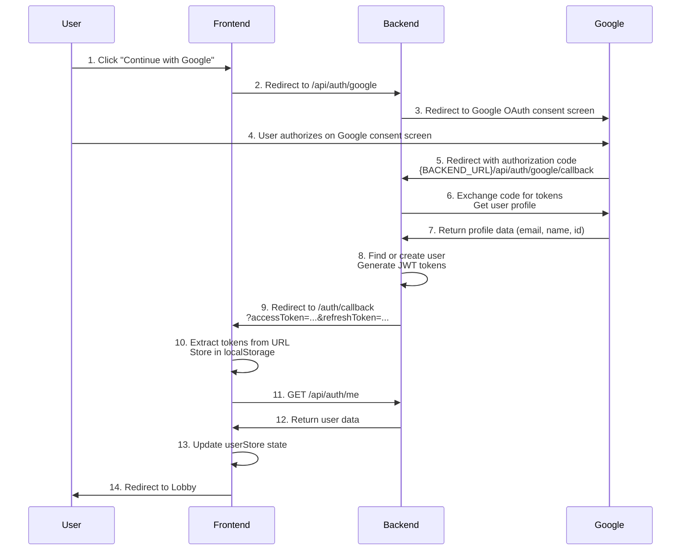
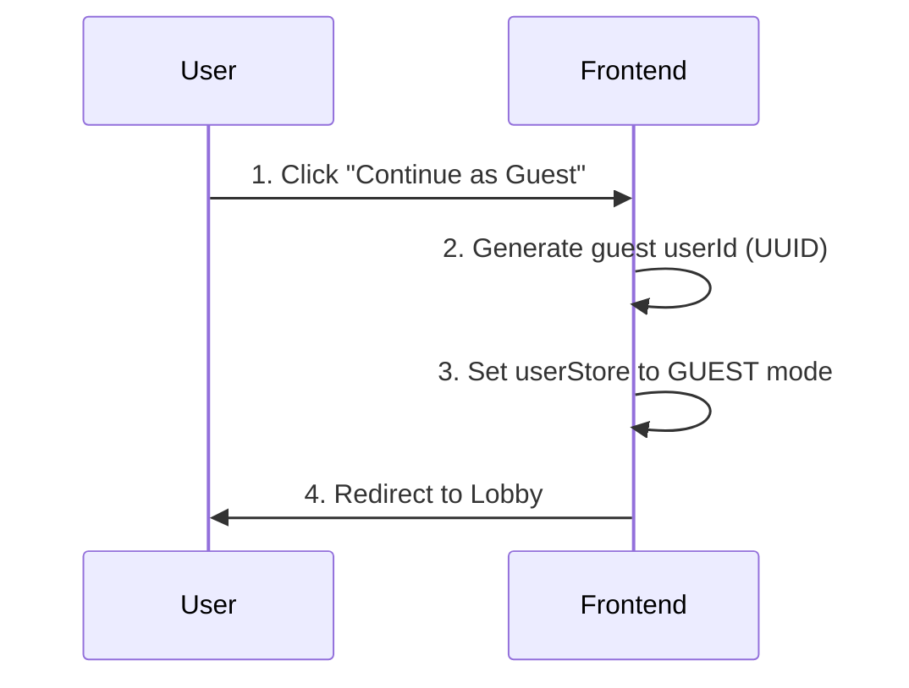

# COLLAB - Jam Band Frontend

> **🎵 A real-time collaborative music-making web application**  
> Built for musicians who want to jam together online with minimal latency!

## ⚠️ Project Disclaimer

**This is a vibe-coding project** by a frontend developer who:
- 🎯 Has some knowledge of music theory
- 🎸 Can play some instruments
- 💻 Is passionate about coding and music
- 🚧 Built this while jamming to music and exploring the creative intersection of coding and music production

*This is NOT a professional music production tool. It's a fun, experimental project for learning and jamming with friends!*

## 🎵 What It Does

Jam Band lets you create music together with friends in real-time using **virtual instruments with music theory assistance** for low-mid level musicians, and **physical instrument support** for high-level players who want to plug in their real instruments.

### Two Room Types:

**Perform Room** - Perfect for **live jamming sessions** with synchronized instruments, step sequencers, and ultra-low latency voice chat. Ideal for remote jam sessions, music lessons, skill development, or just having fun making music together.

**Arrange Room** - **Collaborative DAW** where multiple users can simultaneously create tracks, record audio/MIDI regions, edit notes in a piano roll, and work on music production projects in real-time. Features multi-track timeline editing, region recording, MIDI editing, and collaborative mixing - think **Google Docs but for music production**.

## ✨ Key Features

### Perform Room (Live Jamming)
- **🎸 Virtual Instruments**: Guitar, Bass, Keyboard, Drums, Synthesizer with real-time collaboration
- **🎤 Ultra-Low Latency Voice Chat**: WebRTC mesh network optimized for musical timing
- **🥁 Synchronized Metronome**: BPM synchronization across all users with visual indicators
- **🎼 Step Sequencer**: Collaborative pattern creation and loop sharing
- **🎚️ Audio Effects**: Real-time effects chains (reverb, delay, distortion) with live parameter control
- **🎹 MIDI Controller Support**: Full external MIDI device integration
- **🥁 General MIDI Percussion Mapping**: Standardized drum note mapping (Z/X page navigation) for consistent playback and MIDI device compatibility
- **👥 Advanced Room Management**: Owner/member roles, approval system, room settings
- **📱 PWA Support**: Installable app with offline capabilities and push notifications
- **🎵 Music Theory Assistance**: Scale helpers
- **⚡ Performance Optimization**: Dynamic polyphony, adaptive audio quality, browser-specific optimizations

### Arrange Room (Collaborative DAW)
- **🎛️ Multi-track Timeline**: Create and arrange multiple audio/MIDI tracks with visual timeline editing
- **🎹 Piano Roll Editor**: Real-time MIDI note editing with velocity control and quantization
- **🎙️ Audio Recording**: Record audio regions directly into tracks with waveform visualization
- **🎵 MIDI Recording**: Record MIDI performances from virtual instruments or external MIDI controllers
- **🎚️ Synthesizer Integration**: Built-in synthesizers with real-time parameter control per track
- **🔊 Track Effects**: Per-track effect chains with collaborative parameter adjustments
- **📊 Real-time Collaboration**: Multiple users editing tracks, regions, and notes simultaneously
- **🔒 Collaborative Locking**: Smart locking system prevents editing conflicts between users
- **👥 Presence Tracking**: See what other users are editing in real-time
- **💾 Project Management**: Save and load collaborative projects with full state preservation
- **📱 Mobile Responsive**: Full touch support for mobile devices with optimized UI
- **🎤 Voice Chat Integration**: Ultra-low latency voice communication while producing
- **⌨️ Keyboard Shortcuts**: Professional DAW-style shortcuts for efficient workflow
- **🧪 Comprehensive Testing**: 76 passing tests with regression prevention for all features

## 🚀 Quick Start

### Prerequisites
- Node.js 18+ or Bun
- Modern web browser with Web Audio API support

### Installation

1. **Clone and install**
   ```bash
   git clone <repository-url>
   cd jam-band-fe
   bun install
   ```

2. **Start development**
   ```bash
   bun dev
   ```

3. **Open browser**
   Navigate to `http://localhost:5173`

4. **Run tests (optional)**
   ```bash
   bun test
   ```

## 🎛️ Audio Architecture

### **Ultra-Low Latency Design**
- **Instruments**: 48kHz, `"interactive"` latency hint for minimal musical delay
- **Voice Chat**: 48kHz, `"interactive"` latency hint for minimal voice delay
- **Separated Contexts**: No competition between music and voice processing
- **Dynamic Optimization**: Automatic performance scaling during voice calls

### **Performance Features**
- 4ms note processing intervals
- Dynamic polyphony (32 → 6 notes during voice calls)
- Browser-specific optimizations
- Network optimizations for mesh networks

### **MIDI & Percussion Standards**
- **General MIDI Percussion**: Drum pads use standardized GM note mapping (C1-A4)
- **Page Navigation**: Z/X keys for 3 pages of 16 drum pads (48 total positions)
- **MIDI Device Ready**: Compatible with external MIDI controllers using standard percussion mapping
- **Pattern Portability**: Sequencer patterns work consistently across all drum machines

## ⚙️ Technical Requirements & Notes

### **Current Implementation (POC)**
- **WebRTC Mesh Network**: Using WebRTC mesh for ultra-low latency, but this limits the number of participants per session
- **Voice Latency**: Depends on your browser and hardware. Technically, we cannot bypass the browser's audio processing pipeline
- **Server Location**: Currently only in Southeast Asia, so latency may vary depending on your geographical location

### **Network Recommendations**
- **LAN Cable**: Recommended over WiFi or cellular for stable and low latency
- **Stable Connection**: Ensure your network connection is stable for the best experience
- **Bandwidth**: Sufficient bandwidth for real-time audio streaming

### **Browser Compatibility**
- **Chromium-based Browsers**: Chrome, Edge, Brave recommended for:
  - Full MIDI device connection support
  - Complete synthesizer instrument functionality
  - Best overall performance
- **WebKit Browsers**: Some instruments may not work properly
- **Modern Browsers**: Web Audio API support required

### **Pro Tips for Best Performance**
- Close unnecessary browser tabs and applications
- Use headphones to avoid audio feedback
- Ensure microphone permissions are enabled
- Test your audio setup before joining a session
- Use a wired internet connection when possible

## 🎯 Perfect For

### Perform Room (Live Jamming)
- **🎵 Low-Mid Level Musicians**: Virtual instruments with built-in music theory assistance
- **🎸 High-Level Players**: Plug in physical instruments for real-time collaboration
- **🎤 Singers**: Minimal delay between singing and hearing playback
- **🎓 Music Learners**: Built-in scales, chords, and theory helpers
- **🎛️ Music Producers**: Brainstorm ideas, experiment with synthesizers, create patterns
- **🌍 Remote Collaboration**: Jam with friends anywhere in the world

### Arrange Room (Collaborative Production)
- **🎼 Music Production Teams**: Collaborate on full tracks like working on a shared document
- **🎧 Remix Artists**: Multiple producers working on the same project simultaneously
- **🎵 Songwriters**: Real-time collaborative composition with multi-user MIDI editing
- **🎚️ Mix Engineers**: Collaborative mixing sessions with live parameter adjustments
- **🎓 Music Education**: Teachers and students working together on production projects
- **🏢 Music Studios**: Distributed production workflows across multiple locations
- **🎹 Beat Makers**: Create and arrange beats collaboratively with shared timeline
- **🎸 Band Rehearsals**: Record and arrange song ideas together in real-time

## 🛠️ Tech Stack

- **Frontend**: React 19, TypeScript, Vite 7
- **Audio**: Web Audio API, Tone.js 15, Smplr 0.16
- **Real-time**: Socket.IO 4.8, WebRTC
- **State**: Zustand 5, TanStack Query 5
- **Styling**: Tailwind CSS 4, DaisyUI 5
- **Testing**: Vitest 2, React Testing Library 16, 74 comprehensive tests with regression prevention
- **PWA**: VitePWA with Workbox
- **Dev Tools**: ESLint 9, Prettier 3, TypeScript 5.8

## 🏗️ Architecture & Data Flow

### **Service Layer & State Management**
We use **Zustand** for state management, but direct access to stores is abstracted via a **Service Layer**.
- **Stores**: Hold the state and basic actions (e.g., `trackStore`, `regionStore`).
- **Services**: Encapsulate business logic, synchronize with other services, and handle store interactions (e.g., `TrackService`, `DAWSyncService`).
- **Selectors**: Optimized hooks for reading state in React components to prevent unnecessary re-renders.



### **Real-time Data Flow (DAW Sync)**
The **Arrange Room** uses a sophisticated synchronization engine to keep multiple users in sync while editing audio/MIDI tracks.



### **Performance Optimizations**
- **SocketMessageQueue**: A utility class that batches and throttles high-frequency events (like cursor movement, fader adjustment, region dragging) to reduce network load and server strain. It drops intermediate updates and only sends the latest state per entity within a batch interval (default 16ms).
- **Lazy Loading**: Route-based code splitting using `React.lazy` and `Suspense` to minimize initial bundle size.
- **WebRTC Mesh**: Peer-to-peer voice chat that bypasses the server for audio streaming, ensuring minimal latency.

## 📁 Project Structure

```
src/
├── features/           # Feature-based architecture
│   ├── audio/          # Audio processing & WebRTC voice
│   ├── instruments/    # Virtual instruments (Guitar, Bass, Drums, Synth)
│   │   ├── constants/  # Including General MIDI percussion mapping
│   │   └── utils/      # Including GM note mapper service
│   ├── rooms/          # Room management & Socket.IO integration
│   │   ├── core/       # Room type architecture (Perform + Arrange)
│   │   └── types/      # RoomType configurations & factory patterns
│   ├── metronome/      # Synchronized timing across users
│   ├── sequencer/      # Step sequencer for pattern creation (uses GM notes for drums)
│   ├── effects/        # Audio effects chains
│   ├── daw/            # Arrange Room DAW features
│   │   ├── components/ # Multi-track, piano roll, region editor, transport
│   │   ├── hooks/      # Playback, recording, collaboration hooks
│   │   ├── stores/     # DAW state management (tracks, regions, notes)
│   │   └── contexts/   # Collaboration context for real-time sync
│   └── ui/             # Shared UI components & state
├── shared/             # Cross-feature utilities & stores
├── pages/              # Main app routes (Lobby, PerformRoom, ArrangeRoom, Invite)
├── app-config/         # Router & provider configuration
├── test/               # Test setup & utilities
└── __tests__/          # Integration tests & testing documentation
```

## 🎮 Available Scripts

- **`bun dev`** - Start development server with HTTPS (required for WebRTC)
- **`bun build`** - TypeScript compilation + Vite production build
- **`bun preview`** - Preview production build locally
- **`bun lint`** - Run ESLint with React hooks rules
- **`bun format`** - Format code with Prettier
- **`bun test`** - Run comprehensive test suite (74 tests with regression prevention)
- **`bun test:run`** - Run tests once (CI mode)
- **`bun test:ui`** - Run tests with interactive UI dashboard
- **`bun test:coverage`** - Generate detailed coverage reports
- **`bun test integration`** - Run cross-feature integration tests

## 🌐 Browser Support

- **Chrome 90+** ✅ *Recommended - Full MIDI & synthesizer support*
- **Edge 90+** ✅ *Recommended - Full MIDI & synthesizer support*
- **Brave 90+** ✅ *Recommended - Full MIDI & synthesizer support*
- **Firefox 88+** ⚠️ *Limited MIDI support, some synthesizer instruments may not work*
- **Safari 14+** ⚠️ *WebKit limitations - some instruments don't work properly*

> **Best Performance**: Chromium-based browsers (Chrome, Edge, Brave) provide the most reliable Web Audio API implementation and full MIDI device support.

## 🔧 Configuration

### Environment Variables
Create `.env.local`:
```env
VITE_API_URL=http://localhost:3001
```

> **Note**: Socket.IO URL is automatically derived from API URL. HTTPS is auto-configured in development via `vite-plugin-mkcert` for WebRTC compatibility.

## 🔐 Authentication Flow

The application supports two authentication methods: **Email/Password Login** and **Google OAuth**. Users can also continue as **Guest** without authentication.

### Email/Password Login Flow



**Steps:**
1. User enters email and password on `/login` page
2. Frontend sends `POST /api/auth/login` with credentials
3. Backend validates credentials, generates JWT access token and refresh token
4. Backend returns user data and tokens
5. Frontend stores tokens in `localStorage` (`auth_token`, `refresh_token`)
6. Frontend updates `userStore` with authenticated user state
7. User is redirected to Lobby (`/`)

**Token Management:**
- Access tokens are stored in `localStorage` and sent in `Authorization` header
- Refresh tokens are used to obtain new access tokens when expired
- Tokens are automatically validated on app startup via `checkAuth()` hook

### Google OAuth Login Flow



**Steps:**
1. User clicks "Continue with Google" on `/login` page
2. Frontend redirects browser to `{BACKEND_URL}/api/auth/google`
3. Backend redirects to Google OAuth consent screen
4. User authorizes the application on Google
5. Google redirects back to `{BACKEND_URL}/api/auth/google/callback` with authorization code
6. Backend exchanges code for Google tokens, finds or creates user, generates JWT tokens
7. Backend redirects to `{FRONTEND_URL}/auth/callback?accessToken=...&refreshToken=...`
8. Frontend `AuthCallback` page receives tokens in URL query parameters
9. Frontend extracts and stores tokens in `localStorage`
10. Frontend fetches user data with `GET /api/auth/me` using access token
11. Backend returns authenticated user data
12. Frontend updates `userStore` with authenticated user state
13. User is redirected to Lobby (`/`)

**OAuth Configuration:**
- **Authorized JavaScript origins**: Frontend URL (e.g., `http://localhost:5173`)
- **Authorized redirect URIs**: Backend callback URL (e.g., `http://localhost:3001/api/auth/google/callback`)
- See `GOOGLE_OAUTH_SETUP.md` for detailed setup instructions

### Guest Mode Flow



**Steps:**
1. User clicks "Continue as Guest" on login page or lobby
2. Frontend generates a unique guest `userId` (UUID)
3. Frontend sets `userStore` to `GUEST` mode with generated username
4. User can access public rooms but cannot join private rooms

### Authentication State Management

**User Store (`userStore.ts`):**
- `isAuthenticated`: Boolean indicating if user is logged in
- `userType`: `"GUEST" | "REGISTERED" | "PREMIUM"`
- `authUser`: User object with id, email, username, etc.
- `userId`: Unique user identifier (for both authenticated and guest users)

**Token Storage:**
- Access token: `localStorage.getItem("auth_token")`
- Refresh token: `localStorage.getItem("refresh_token")`
- Tokens are automatically included in API requests via `axiosInstance` interceptors

**Auto-authentication:**
- On app startup, `useAuth().checkAuth()` validates stored tokens
- If token is valid, user is automatically logged in
- If token is invalid/expired, tokens are removed and user is logged out

### Authentication Pages

- **`/login`**: Login page with email/password form and Google OAuth button
- **`/register`**: Registration page for new users
- **`/auth/callback`**: OAuth callback handler that processes tokens from URL
- **`/verify-email/:token`**: Email verification page
- **`/forgot-password`**: Password reset request page
- **`/reset-password`**: Password reset page with token

## 🤝 Contributing

1. Fork the repository
2. Create a feature branch
3. Make your changes
4. Submit a pull request

## 📄 License

MIT License

---

*Built with ❤️ for musicians everywhere*

> **Note**: This app prioritizes **lowest latency over audio quality** - perfect for real-time musical collaboration where timing is everything!
