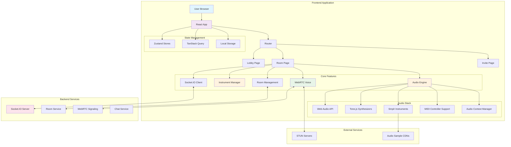
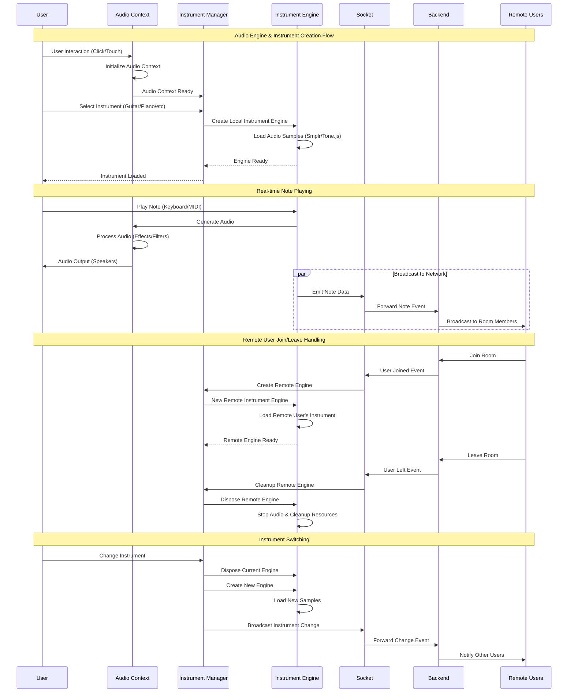
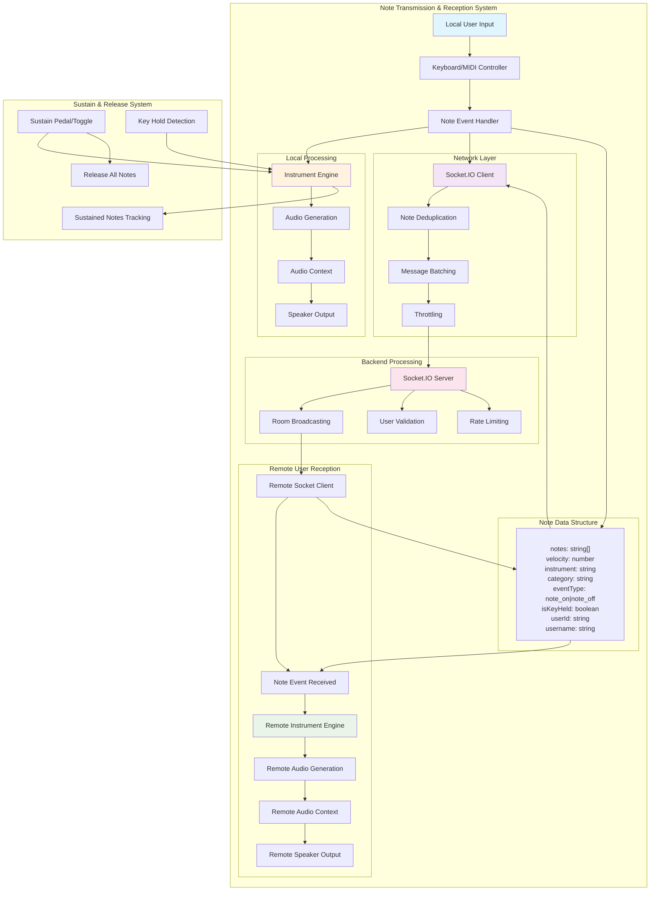
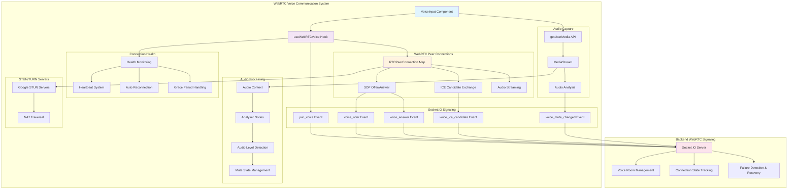

# Jam Band Frontend

A real-time collaborative music-making web application built with React, TypeScript, and modern web technologies. Create music together with friends in virtual jam sessions using various virtual instruments.

## 🎵 Features

- **Virtual Instruments**: Guitar, Bass, Keyboard, Drums, Synthesizer, and more
- **Real-time Collaboration**: Join rooms and jam with other musicians
- **WebRTC Voice Chat**: Communicate with band members during sessions
- **MIDI Controller Support**: Use external MIDI devices for enhanced control
- **Responsive Design**: Works on desktop and mobile devices
- **PWA Support**: Install as a progressive web app for offline access
- **Scale & Chord Support**: Built-in music theory helpers
- **Preset Management**: Save and load instrument configurations

## � What's new (Aug 2025)

- Network diagnostics and reliability improvements: frontend now measures round-trip ping and RTC latency and surfaces lightweight diagnostics in the UI.
- Socket optimizations: message batching, note-event deduplication, and connection pooling reduce network chatter and improve responsiveness.
- WebRTC reliability: health checks, automatic reconnection with backoff, ICE candidate buffering to avoid race conditions, and heartbeat/grace-period handling for smoother voice sessions.
- State/store refactor: instrument stores were consolidated into a small `createInstrumentStore` factory (Zustand + persist) and the preset manager was rewritten to a reducer-based implementation for safer import/export behavior.


## �🏗️ System Architecture

The Jam Band frontend is built with a modular, feature-based architecture designed for real-time audio collaboration:



## 🎼 Audio Engine & Instrument System

### Architecture Overview

The audio engine is the heart of the application, managing instrument instances, audio processing, and real-time synchronization:



### Key Components

#### 1. **Audio Context Manager** (`useAudioContextManager`)
- Manages Web Audio API context initialization
- Handles browser-specific audio requirements
- Optimizes audio latency and performance
- Provides automatic context resume on user interaction

#### 2. **Instrument Manager** (`useInstrumentManager`)
- **Local Engine Management**: Handles the user's own instrument
- **Remote Engine Management**: Creates and manages instruments for other users
- **Dynamic Loading**: Loads instrument samples on-demand
- **Memory Management**: Efficient cleanup when users leave

#### 3. **Instrument Engine** (`InstrumentEngine`)
- **Dual Audio Stack**:
  - **Traditional Instruments**: Uses Smplr library for realistic samples (guitar, piano, drums)
  - **Synthesizers**: Uses Tone.js for advanced synthesis (analog, FM, filters)
- **Performance Optimizations**:
  - Note deduplication to prevent audio flaming
  - Batched note processing for better performance
  - Audio buffer caching for faster loading
- **Safari Compatibility**: Special handling for Safari's audio limitations

### Instrument Categories

#### **Traditional Instruments** (Smplr-based)
- **Guitar**: Realistic guitar samples with multiple playing modes
- **Bass**: Deep bass sounds with melody capabilities  
- **Piano/Keyboard**: High-quality piano samples
- **Drums**: Comprehensive drum kits with individual samples

#### **Synthesizers** (Tone.js-based)
- **Analog Synthesizers**: Classic analog-style synthesis with filters
- **FM Synthesizers**: Advanced frequency modulation synthesis
- **Real-time Parameter Control**: Live tweaking of filters, envelopes, oscillators
- **Preset System**: Save and share synthesizer configurations

## 🎵 Real-time Note Transmission System

The note transmission system ensures low-latency, synchronized musical collaboration:



### Performance Optimizations

#### **Network Level**
- **Note Deduplication**: Prevents duplicate note events (20ms window)
- **Message Batching**: Groups multiple events for efficient transmission (8ms intervals)
- **Throttled Updates**: Synthesizer parameter changes are throttled (8ms)
- **Connection Pooling**: Reuses socket connections for better performance

#### **Audio Level**
- **Optimized Processing**: 4ms note processing intervals for low latency
- **Batch Audio Operations**: Processes multiple notes simultaneously
- **Memory Management**: Automatic cleanup of audio resources
- **Safari Optimizations**: Special handling for Safari's audio limitations

## 🎙️ WebRTC Voice Communication

Real-time voice chat enables natural communication during jam sessions:



### WebRTC Features

#### **Reliability & Recovery**
- **Connection Health Monitoring**: 15-second health checks
- **Automatic Reconnection**: Up to 3 reconnection attempts with exponential backoff
- **Heartbeat System**: 30-second heartbeats to detect connection issues
- **Grace Period Management**: 30-second grace period for network interruptions
- **ICE Connection Handling**: Robust handling of connection state changes

#### **Audio Features**
- **Real-time Audio Analysis**: Live audio level detection and visualization
- **Mute State Synchronization**: Synchronized mute/unmute across all users
- **Audio Quality Optimization**: Optimized for low-latency voice communication
- **Cross-platform Support**: Works across different browsers and devices

#### **User Experience**
- **Audience Mode**: Non-transmitting users can still receive audio
- **Visual Indicators**: Real-time audio level visualization
- **Connection Status**: Clear feedback on connection health
- **Automatic Recovery**: Seamless reconnection after network issues

## 🎛️ User Join/Leave Handling

### When a New User Joins:
1. **Room Connection**: User connects to Socket.IO room
2. **Instrument Loading**: System loads user's selected instrument
3. **Engine Creation**: New `InstrumentEngine` instance created
4. **WebRTC Setup**: Voice connection established with existing users
5. **State Synchronization**: Current room state shared with new user
6. **Broadcast**: Other users notified of new member

### When a User Leaves:
1. **Cleanup Signal**: Leave event sent to backend
2. **Engine Disposal**: User's `InstrumentEngine` disposed
3. **WebRTC Cleanup**: Voice connections terminated
4. **Memory Cleanup**: All audio resources released
5. **State Update**: Room state updated for remaining users
6. **Broadcast**: Other users notified of departure

## 🛠️ Tech Stack

### Core Technologies
- **React 19** - Modern React with concurrent features
- **TypeScript** - Type-safe development
- **Vite** - Fast build tool and dev server
- **Tailwind CSS** - Utility-first CSS framework
- **DaisyUI** - Component library built on Tailwind

### State Management & Data
- **Zustand** - Lightweight state management
- **TanStack Query** - Server state management
- **Axios** - HTTP client for API calls

### Audio & Music
- **Tone.js** - Web Audio framework for music applications
- **Smplr** - Sample-based audio engine
- **Web Audio API** - Native browser audio capabilities

### Real-time Communication
- **Socket.IO Client** - Real-time bidirectional communication
- **WebRTC** - Peer-to-peer voice communication

### Development Tools
- **ESLint** - Code linting and quality
- **Prettier** - Code formatting
- **SWC** - Fast TypeScript/JSX compilation

## 🚀 Getting Started

### Prerequisites
- Node.js 18+ or Bun
- Modern web browser with Web Audio API support

### Installation

1. **Clone the repository**
   ```bash
   git clone <repository-url>
   cd jam-band-fe
   ```

2. **Install dependencies**
   ```bash
   # Using npm
   npm install
   
   # Using Bun (recommended)
   bun install
   ```

3. **Start development server**
   ```bash
   # Using npm
   npm run dev
   
   # Using Bun
   bun dev
   ```

4. **Open your browser**
   Navigate to `http://localhost:5173`

## 📁 Project Structure

```
src/
├── app-config/          # App configuration and routing
├── features/            # Feature-based modules
│   ├── audio/          # Audio processing and voice features
│   │   ├── components/ # Audio UI components
│   │   ├── hooks/      # Audio management hooks
│   │   └── utils/      # Audio utilities
│   ├── instruments/    # Virtual instrument implementations
│   │   ├── components/ # Instrument UI components
│   │   ├── hooks/      # Instrument logic hooks
│   │   ├── stores/     # Instrument state management
│   │   └── utils/      # Instrument utilities
│   ├── rooms/          # Room management and collaboration
│   │   ├── components/ # Room UI components
│   │   ├── hooks/      # Room management hooks
│   │   └── services/   # Room API services
│   └── ui/             # Shared UI components
├── pages/               # Page components
├── shared/              # Shared utilities and components
└── main.tsx            # Application entry point
```

## 🎮 Available Scripts

- **`dev`** - Start development server with hot reload
- **`build`** - Build for production
- **`preview`** - Preview production build locally
- **`lint`** - Run ESLint for code quality
- **`format`** - Format code with Prettier

## 🎹 Instruments

### Guitar
- **Basic Fretboard Mode**: Traditional guitar fretboard interface
- **Chord Mode**: Common chord shapes and progressions
- **Melody Mode**: Single-note lead guitar playing
- **Realistic Samples**: High-quality guitar audio samples

### Bass
- **Melody Bass**: Scale-based note selection for bass lines
- **Deep Sound**: Rich, low-frequency bass tones
- **Customizable Patterns**: Create and modify bass lines

### Keyboard
- **Basic Piano Layout**: Traditional piano keyboard interface
- **Chord Mode**: Play chords with modifier keys
- **Melody Mode**: Single-note piano playing
- **Multiple Octaves**: Full piano range available

### Drums
- **Drum Machine**: Pattern-based drum programming
- **Individual Samples**: Access to individual drum sounds
- **Preset Patterns**: Built-in rhythm patterns
- **Real-time Creation**: Live drum pattern creation

### Synthesizer
- **Multiple Types**: Analog and FM synthesis
- **Real-time Control**: Live parameter tweaking
- **Filter System**: Advanced filtering capabilities
- **Preset Management**: Save and load custom sounds

## 🔧 Configuration

### Environment Variables
Create a `.env.local` file for local development:
```env
VITE_API_URL=http://localhost:3000
VITE_SOCKET_URL=http://localhost:3000
```

### Audio Settings
- **Adjustable Latency**: Optimize for your system
- **Buffer Size Optimization**: Balance latency vs stability
- **Sample Rate Configuration**: Match your audio interface

## 🌐 Browser Support

- **Chrome 90+** - Full feature support
- **Firefox 88+** - Full feature support  
- **Safari 14+** - Full feature support with optimizations
- **Edge 90+** - Full feature support

## 📱 PWA Features

- **Offline Capability**: Core functionality works offline
- **Install Prompt**: Native app-like installation
- **Service Worker**: Intelligent caching strategy
- **App-like Experience**: Full-screen, native feel

## 🔊 Audio Performance

### Latency Optimization
- **4ms Processing Intervals**: Ultra-low latency note processing
- **Optimized Audio Context**: Configured for minimal latency
- **Batch Processing**: Efficient handling of multiple audio events
- **Hardware Acceleration**: Leverages Web Audio API optimizations

### Memory Management
- **Dynamic Loading**: Instruments loaded on-demand
- **Automatic Cleanup**: Resources freed when users leave
- **Audio Buffer Caching**: Intelligent sample caching
- **Memory Monitoring**: Prevents memory leaks

## 🤝 Contributing

1. Fork the repository
2. Create a feature branch
3. Make your changes
4. Run tests and linting
5. Submit a pull request

## 📄 License

This project is licensed under the MIT License.

## 🆘 Support

For support and questions, please open an issue in the repository or contact the development team.

---

*Built with ❤️ for musicians everywhere*
